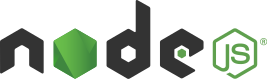

<h1 align="center">
  
  <a href="https://finnboard0.netlify.app/">FinBoard</a>
</h1>

<p align = "center">
FinBoard is a retro-themed personal finance dashboard that empowers users to manage budgets, monitor transactions, analyze spending trends through interactive visualizations, and stay on top of their financial goals—all securely from the browser.
</p>


<div align="center">

### 📊 Interactive Dashboard

Monitor your financial health at a glance with powerful visualizations, detailed spending insights, and an easy-to-navigate dashboard experience.

</div>

___

<table>
  <tr>
    <td width="50%">
      <h3>💰 Budget Management</h3>
      <p>
        Set spending limits, track your expenses in real time, and monitor your financial goals with ease.
        Stay in control of your budget and make smarter spending decisions.
      </p>
    </td>
    <td width="50%">
      
    </td>
  </tr>
</table>

___

<table>
  <tr>
    <td width="50%">
      
    </td>
    <td width="50%">
      <h3>📜 Transaction History</h3>
      <p>
        Gain complete visibility into your finances with a detailed transaction history.
        Quickly search, filter, and categorize records to better understand your spending habits
        and maintain full control over your financial journey.
      </p>
    </td>
  </tr>
</table>

___

<table>
  <tr>
    <td width="50%">
      <h3>🧠 Insights</h3>
      <p>
        📊 Get a complete overview of your financial health with smart insights and spending analytics.<br>
        💰 Instantly understand savings, expenses, and income trends to make better money decisions.<br>
        📈 Identify top spending categories and track monthly patterns to improve financial control.
      </p>
    </td>
    <td width="50%">
      
    </td>
  </tr>
</table>

___

<table>
  <tr>
    <td width="50%">
        
    </td>
    <td width="50%">
      <h3>📁 Secure Local Data</h3>
      <p>
        Your financial data stays completely private in your browser — no backend required.<br><br>
        📤 Import your CSV or financial documents effortlessly to analyze your transactions.<br><br>
        💱 Flexible currency support lets you view and manage data in your preferred currency.
      </p>
    </td>
  </tr>
</table>

___

<h1 align="left">
  <a>Let’s Get Started</a>
</h1>
 
 <span style="font-size:32px; font-weight:bold;">
  Option 1
</span><br><br>

<h1 align="left">
  
  <a href="https://nodejs.org/en" target="_blank">Node.js (Recommended)</a>
</h1>

1. Clone repository

```bash
git clone https://github.com/khanirfan18/finBoard.git
cd finBoard
```
<br>

2. Install packages

```bash
npm install
```
<br>

3. Start development server

```bash
npm run dev
```

<br>

 <span style="font-size:25px; font-weight:bold;">
🎉 You are all set to run the project.  
Start the server and open it in your browser to explore FinBoard.
</span><br><br>

___

 <span style="font-size:32px; font-weight:bold;">
  Other Option
</span><br><br>

## 🤝 Contributor Notice

Please review the [CONTRIBUTING.md](./CONTRIBUTING.md) before starting your work.

This project is actively evolving, and certain parts of the repository may be reserved for upcoming features and future milestones.

⚠️ Docker support is part of the long-term roadmap and is currently intended for maintainer use. Any Docker-related contributions are out of scope unless explicitly requested in an issue by a maintainer.

All contributors are expected to adhere to the project's [Code of Conduct](./CODE_OF_CONDUCT.md) to ensure a respectful and collaborative environment.

___

<h1 align="center">
  
  <a">Contribute</a>
</h1>

## 🤝 Planning to Contribute?

Your contributions are highly appreciated and help improve FinBoard 🚀

<a href="./CONTRIBUTING.md" style="text-decoration:none;">
  <button>📘 Read CONTRIBUTING Guide</button>
</a>

<a href="./CODE_OF_CONDUCT.md" style="text-decoration:none;">
  <button>📜 View Code of Conduct</button>
</a>

---

### 📌 Before You Start

Please make sure to read the contributing guidelines before opening issues or submitting pull requests.

It includes:

- ✅ Valid issue creation process  
- ✅ Task claiming workflow  
- ✅ Pull request guidelines  
- ✅ Project scope and roadmap expectations  

---

💡 Following these guidelines ensures smooth collaboration and faster reviews.

---

### 🚀 Happy Building!

___


<h1 align="center">
  <a">📜 Community Guidelines</a>
</h1>

## 🤝 Code of Conduct

To maintain a welcoming and respectful environment for everyone, all contributors are expected to follow the project's Code of Conduct.

<a href="./CODE_OF_CONDUCT.md" style="text-decoration:none;">
  <button>📜 View Code of Conduct</button>
</a>

---

### 📌 Expectations

- ✅ Be respectful and constructive in all discussions  
- ✅ Write clear and meaningful issue reports and pull requests  
- ✅ Follow project guidelines while contributing  
- ✅ Help maintain a positive and inclusive community  

---

💙 Thank you for being part of FinBoard and contributing to a better open-source experience!

___
