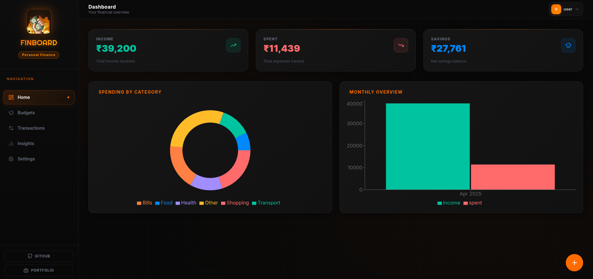
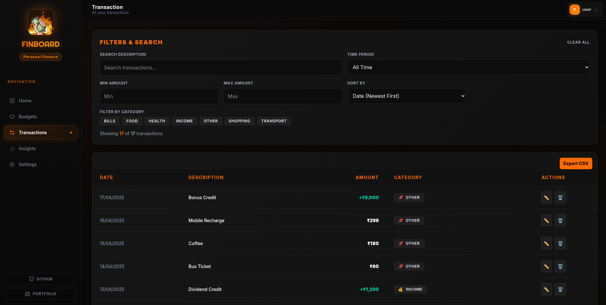
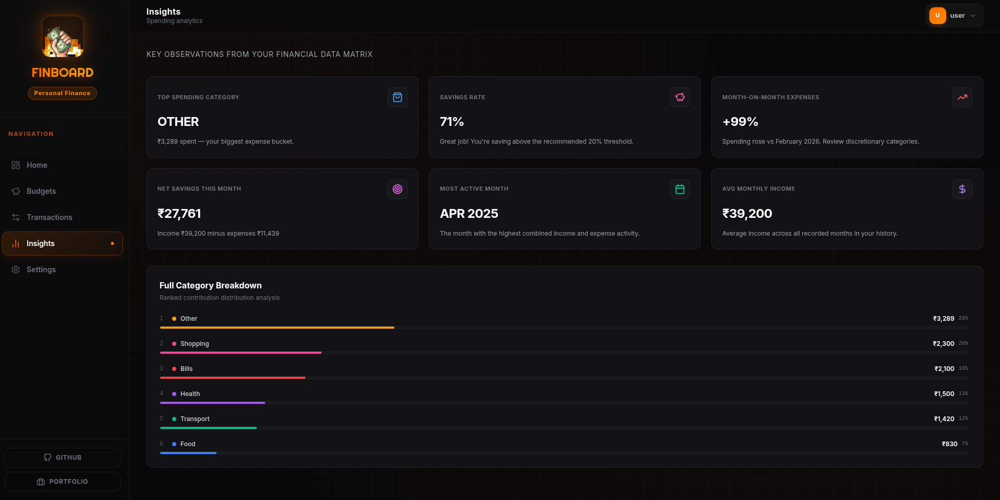

<div align="center">
   <p><strong>
    FinBoard helps users manage budgets, monitor transactions, and analyze spending trends through interactive visualizations while keeping financial data organized and accessible.
  </strong></p>
  <p>
    <a href="https://finnboard0.netlify.app/">
      
    </a>
    
    
    
    
  </p>
   
</div>

---

## 📌 Table of Contents

1. [Features](#-features)  
2. [Privacy First](#-privacy-first)  
3. [Getting Started](#-getting-started)  
4. [Local Development Setup](#-local-development-setup)  
5. [Project Structure](#-project-structure)  
6. [Tech Stack](#-tech-stack)  
7. [Contributing](#-contributing)  
8. [License](#-license)

---

## <p align="center"><strong>A retro-themed personal finance dashboard for budgeting, transaction tracking, and financial insights.</strong></p>

## ✨ Features
<table>
  <tr>
    <td align="center" width="50%">
      <br>
      <b>📊 Interactive Dashboard</b><br>
      <sub>Monitor your financial health at a glance with powerful real-time visualizations.</sub>
    </td>
    <td align="center" width="50%">
      <br>
      <b>💰 Budget Management</b><br>
      <sub>Set limits, track expenses per category, and work toward financial goals.</sub>
    </td>
  </tr>
  <tr>
    <td align="center" width="50%">
      <br>
      <b>📜 Transaction History</b><br>
      <sub>Search, filter, and categorize transactions with complete visibility.</sub>
    </td>
    <td align="center" width="50%">
      <br>
      <b>🧠 Smart Insights</b><br>
      <sub>Identify spending patterns, income trends, and top categories over time.</sub>
    </td>
  </tr>
  <tr>
    <td align="center" colspan=2>
      <br>
      <b>⚙️ Finance Settings</b><br>
      <sub>Manage transactions, CSV upload, currency, and data reset options.</sub>
    </td>
  </tr>
</table>

---

## 🔒 Privacy First

Your financial data remains under your control.

* **Client-side experience** with minimal external dependencies
* **CSV Import** for transaction analysis and management
* **Multi-currency Support** for flexible financial tracking
* **Secure storage options** through the application's supported integrations

---

## 🚀 Getting Started

### Prerequisites

* Node.js v18 or higher
* npm (included with Node.js)

### Installation

```bash
# Clone the repository
git clone https://github.com/khanirfan18/finBoard.git

# Navigate into the project
cd finBoard

# Install dependencies
npm install

# Start the development server
npm run dev
```

Open:

```text
http://localhost:5173
```
---
## 🔧 Local Development Setup

FinBoard uses Supabase for authentication and data storage.

Before running the application locally, configure your Supabase project and environment variables by following the setup guide:

* [SUPABASE_SETUP.md](./SUPABASE_SETUP.md)

If you encounter:

```text
Missing VITE_SUPABASE_URL or VITE_SUPABASE_ANON_KEY
```

make sure you have completed the Supabase setup steps and created the required `.env` file.

---
## 📁 Project Structure

A modular React-based structure with clear separation of UI components, pages, state management, and utilities.

```
FINBOARD/
├── src/
│   ├── assets/              # Static images and icons
│   ├── components/          # Reusable UI components
│   ├── context/             # Global state management (React Context)
│   ├── data/                # Static/mock data
│   ├── hooks/              # Custom React hooks
│   ├── lib/                # Utilities, API config, helpers
│   ├── pages/              # Application pages/routes
│   │   ├── Budgets.jsx
│   │   ├── Dashboard.jsx
│   │   ├── Goals.jsx
│   │   ├── InsightsDashboard.jsx
│   │   ├── Settings.jsx
│   │   └── Transaction.jsx
│   ├── App.jsx             # Main app routing
│   └── main.jsx            # Entry point
│
├── test/                   # Unit / utility tests
│
├── package.json            # Project dependencies & scripts
├── vite.config.js          # Vite configuration
├── index.html              # App root HTML
├── netlify.toml            # Deployment config
├── docker-compose.yml      # Docker support
├── Dockerfile.*            # Docker build configs
├── .env.example            # Environment variables template
├── README.md
└── LICENSE
```
---

## 🛠 Tech Stack

| Layer              | Technologies              |
| ------------------ | ------------------------- |
| Frontend           | React, React Router       |
| Build Tool         | Vite                      |
| Styling            | Tailwind CSS, DaisyUI     |
| Charts             | Recharts                  |
| Icons              | Lucide Icons, Custom SVGs |
| Backend / Database | Supabase                  |

---

## 🤝 Contributing

Contributions are welcome.

Before opening an issue or submitting a pull request, please review:

* [CONTRIBUTING.md](./CONTRIBUTING.md)
* [CODE_OF_CONDUCT.md](./CODE_OF_CONDUCT.md)

### Guidelines

* Follow the issue creation process outlined in the contribution guide
* Claim tasks before beginning work
* Align contributions with the project's scope and roadmap
* Write clear and meaningful commit messages and pull request descriptions
* Maintain respectful and constructive communication

> Docker support is part of the long-term roadmap and is currently reserved for maintainer use. Docker-related contributions are out of scope unless explicitly requested by a maintainer.

---

## 📄 License

This project is licensed under the terms specified in the [LICENSE](./LICENSE) file.
